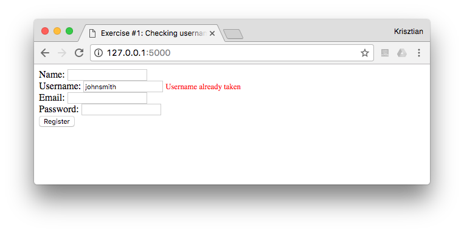
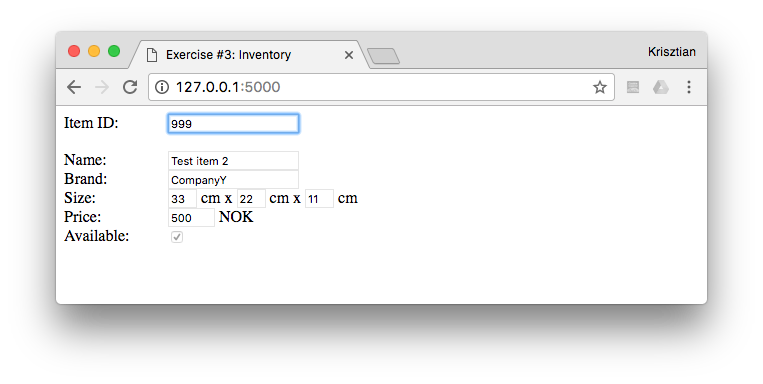

# Async exercises

## Exercise #1: Checking username

Folder [ex_1](ex_1) contains the solution to a previous exercise. 
Rewrite the `checkUsername` function in [exercise1.js](ex_1/exercise1.js) using 
the provided `ajaxGet` function.




## Exercise #1b: Checking username

Folder [ex_1b](ex_1b) contains the solution to a previous exercise.
Rewrite the `checkUsername` function in [exercise1.js](ex_1b/exercise1.js) using 
the provided `ajaxPost` function.

## Exercise #2: Loading

The starter code in [ex_2](ex_2) is identical to the [loading example](../../../examples/ajax/loading/).
Your task is to replace the AJAX requests in [exercise2.js](ex_2/exercise2.js) with 
`fetch`. Try to implement it first using promises and then using an async function.

## Exercise #3: Inventory

Assume that there is an inventory database where each item has a 3-digit unique identifier (e.g., `021`, `987`, etc.). For know, this data is stored as a dictionary in `app.py`.

  - Complete the `invertory()` method in `app.py` such that an inventory item can be looked up based on its 3-digit identifier. Return the inventory record as a JSON object. For example `inventory?item_id=123` should return

```
{"name":"Test item","brand":"CompanyX","size_x":11,"size_y":22,"size_z":33,"price":1000,"available":false}
```

  - Complete `exercise3.js` to parse the JSON response and display the values in the corresponding form fields.




